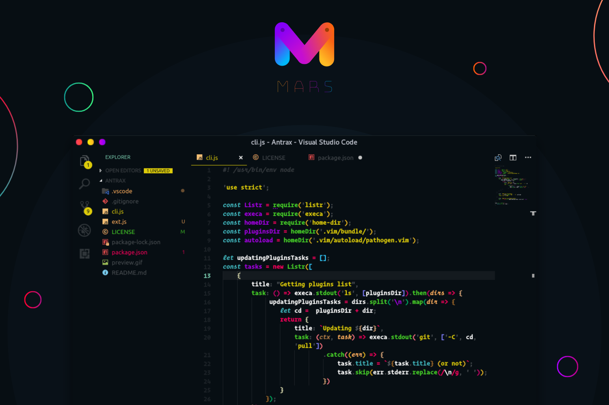

# Installation

1. Open the **Extensions** sidebar in VS Code. `View → Extensions`
1. Search for `Mars`
1. Click **Install** to install it
1. Click **Reload** to reload your editor
1. Navigate to File > Preferences > Color Theme > **Mars**

## License

[MIT](https://github.com/EliverLara/Mars/blob/master/LICENSE.md)
